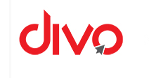

<div align="center">


<br>


<br><br>

[](#)
[](https://linkedin.com/in/suresh78)
[](mailto:suresh78as@gmail.com)
[](https://github.com/suresh078)

</div>

<br>

## 🧭 About Me

```python
class DataAnalyst:
    def __init__(self):
        self.name = "Suresh A"
        self.location = "Chennai, Tamil Nadu, India"
        self.degree = "B.Tech — AI & Data Science  (2023 – 2027)"
        self.focus = ["Data Analysis", "Machine Learning", "Automation", "AI Dashboards"]
        self.status = "Open to opportunities"

    def philosophy(self):
        return "Efficient, ethical, and data-driven solutions — always."

me = DataAnalyst()
```

- 🎓 Currently pursuing **B.Tech in Artificial Intelligence and Data Science**
- 💼 Interned as a **Data Analyst** at a **Warner Music India Group** company
- 📊 Building **AI-powered dashboards** and automation tools that solve real problems
- 🌱 Constantly leveling up — most recently in applied ML and NLP
- ⚡ Fun fact: I'd rather automate a task once than repeat it a hundred times

<br>

## 🛠️ Tech Stack

<div align="center">

<br><br>


</div>

<table align="center">
<tr>
<td valign="top" width="50%">

**📊 Data Analysis & Reporting**
Excel · Power BI · SQL · Python
Google Data Analytics · Google Trends · YouTube Analytics

**🔧 Automation & Scripting**
Google Apps Script · AppSheet · Dialogflow

</td>
<td valign="top" width="50%">

**📋 Program Management**
JIRA · Google Sheets

**🔌 APIs & Integrations**
Google Drive API · YouTube Content ID API
YouTube Reporting & Data API

</td>
</tr>
</table>

<br>

## 📈 GitHub Stats

<div align="center">


<br>


</div>

> 💡 If a card above shows "Error fetching resource," it's almost always the free Vercel demo server being rate-limited — it usually clears on a refresh within a few minutes.

<br>

## 🎓 Education

<table>
<tr><th>Period</th><th>Institution</th><th>Program</th><th>Status</th></tr>
<tr>
<td><code>2023 – 2027</code></td>
<td>Prince Dr K Vasudevan College of Engineering and Technology</td>
<td>B.Tech, Artificial Intelligence &amp; Data Science</td>
<td>🟢 In Progress</td>
</tr>
<tr>
<td><code>2022 – 2023</code></td>
<td>Suddhananda Vidyalaya Matric Hr. Sec. School</td>
<td>High School</td>
<td>✅ Completed</td>
</tr>
</table>

<br>

## 💼 Experience

<table>
<tr>
<td width="120">

</td>
<td>

### Data Analyst — Intern
**DIVO** · *Warner Music India Group Company*
`Jun 2025 → Aug 2025`

Worked with a leading South Indian MCN managing **500+ creators**, music assets, and YouTube channels.

- 📊 Analyzed multi-channel performance data to surface content trends, audience behavior & revenue patterns
- 🤖 Built an **AI-powered analytical dashboard** for real-time metric tracking and decision-making
- 🎧 Used **PyDejavu** & **Olaf** to help build an audio fingerprinting tool for music asset identification

</td>
</tr>
</table>

<br>

## 🚀 Featured Projects

<table>
<tr>
<td width="33%" valign="top">

### 🗂️ Smart Petition Analysis
**AI + OCR + Governance Automation**

Replaces manual handwritten petition reading with an AI/OCR system for instant extraction, classification & routing.

`OCR` `AI/NLP` `Python` `Dashboard`

</td>
<td width="33%" valign="top">

### 🩺 Public Health Chatbot
**AI + NLP + Healthcare**

NLP chatbot offering first-level symptom guidance and routing users to the right public health service.

`AI` `NLP` `Python` `ML`

</td>
<td width="33%" valign="top">

### 🎬 Netflix Data Analysis
**Data Analysis + Visualization**

Turns unstructured Netflix catalog data into insights on genre trends, geography & format.

`Pandas` `NumPy` `Matplotlib` `Seaborn`

</td>
</tr>
</table>

<br>

## 📜 Certifications

<div align="center">


</div>

<br>

## 🌐 Languages

<div align="center">

`🟢 Tamil` — Read · Write · Speak &nbsp;&nbsp;•&nbsp;&nbsp; `🟢 English` — Read · Write · Speak

</div>

<br>

## 📫 Let's Connect

<div align="center">

[](#)
[](https://linkedin.com/in/suresh78)
[](mailto:suresh78as@gmail.com)
[](tel:+919042088400)

<br><br>


<br>


</div>
